# Binaire — Streaming UI

A Netflix-style browsing app built for the Binaire frontend assessment. Browse titles, search by name/ID/year, save a watchlist, and sign in with Firebase.

**Live demo:** [binaire-netlify-movie-app.netlify.app](https://binaire-netlify-movie-app.netlify.app)

---

## Screenshots

### Auth

<p align="center">
  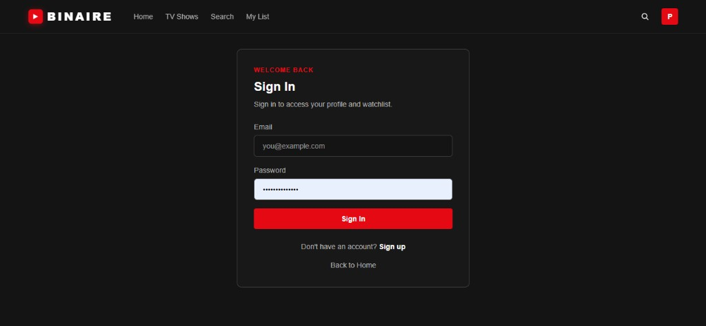
  <br /><sub>Sign in</sub>
</p>

<p align="center">
  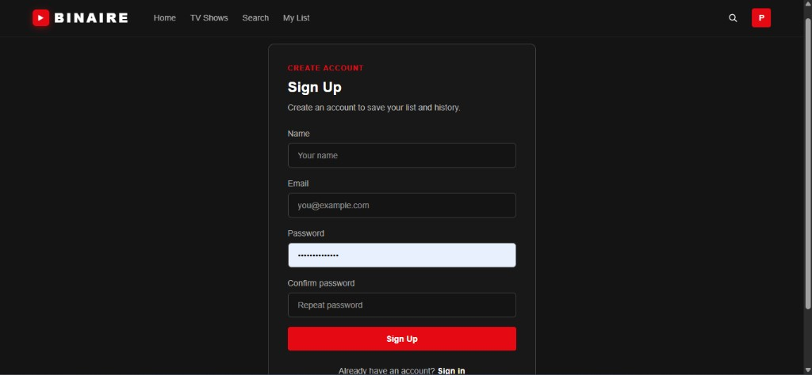
  <br /><sub>Sign up</sub>
</p>

### Home & browse

<p align="center">
  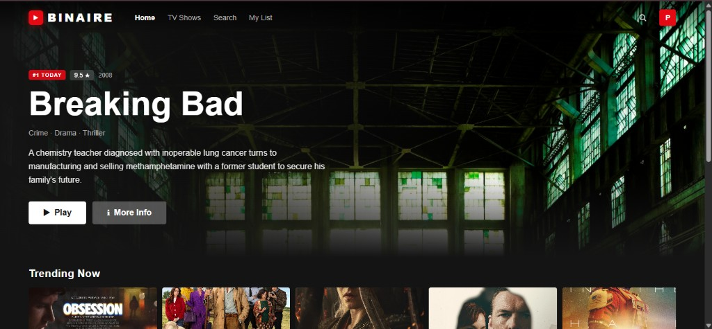
  <br /><sub>Hero</sub>
</p>

<p align="center">
  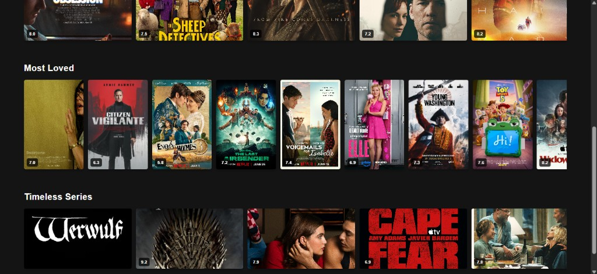
  <br /><sub>Content rows</sub>
</p>

<p align="center">
  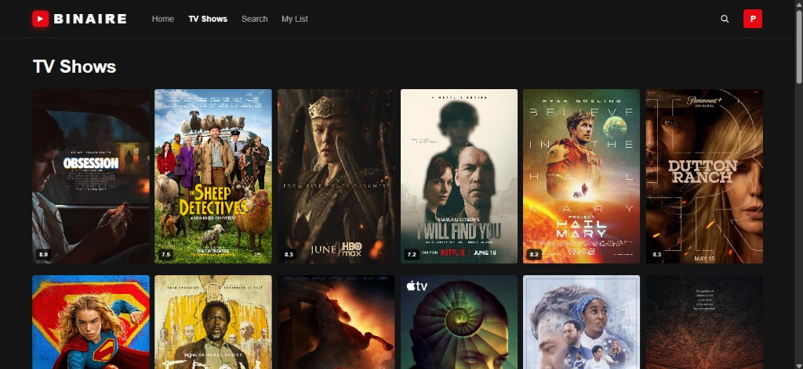
  <br /><sub>TV Shows</sub>
</p>

<p align="center">
  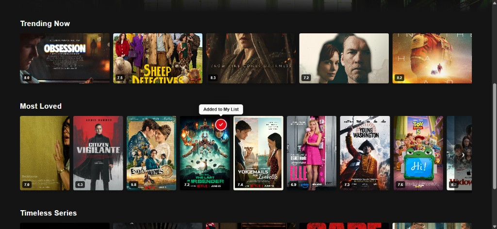
  <br /><sub>Add to list</sub>
</p>

### Title details

<p align="center">
  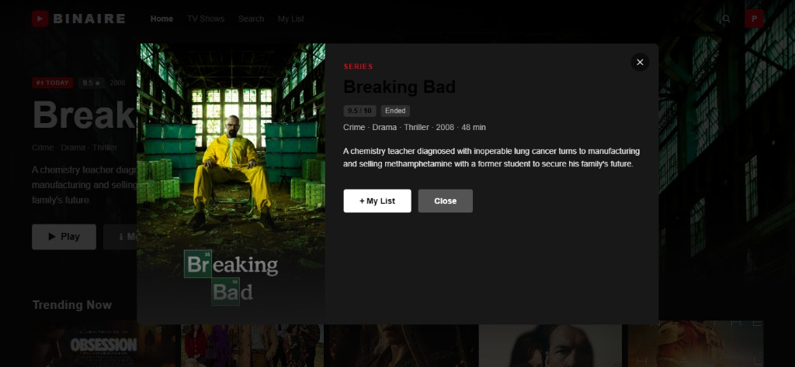
  <br /><sub>Details modal</sub>
</p>

<p align="center">
  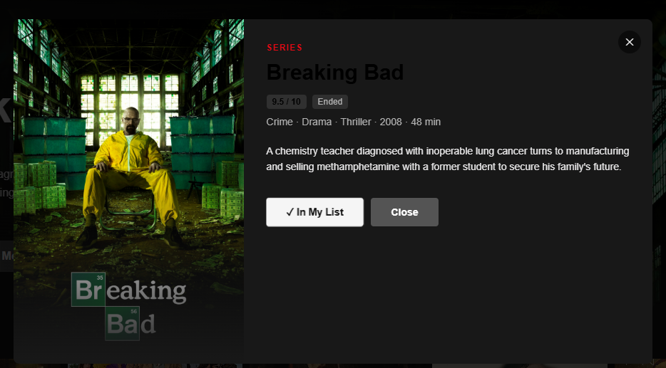
  <br /><sub>In My List</sub>
</p>

<p align="center">
  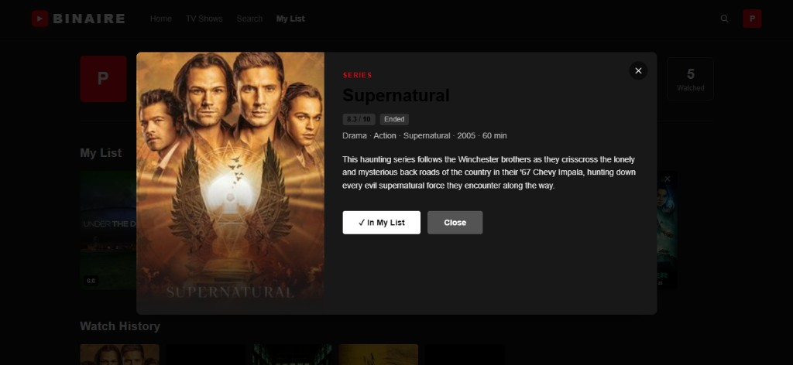
  <br /><sub>From profile</sub>
</p>

### Search

<p align="center">
  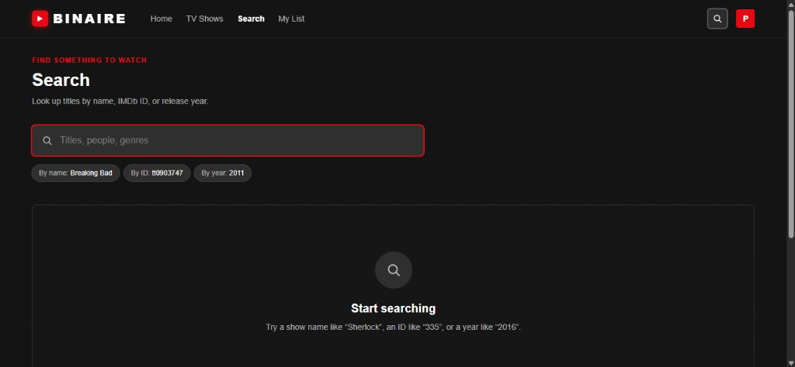
  <br /><sub>Empty state</sub>
</p>

<p align="center">
  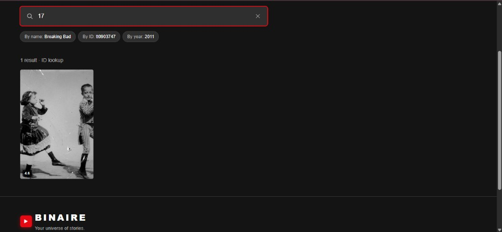
  <br /><sub>ID lookup</sub>
</p>

### Profile & offline

<p align="center">
  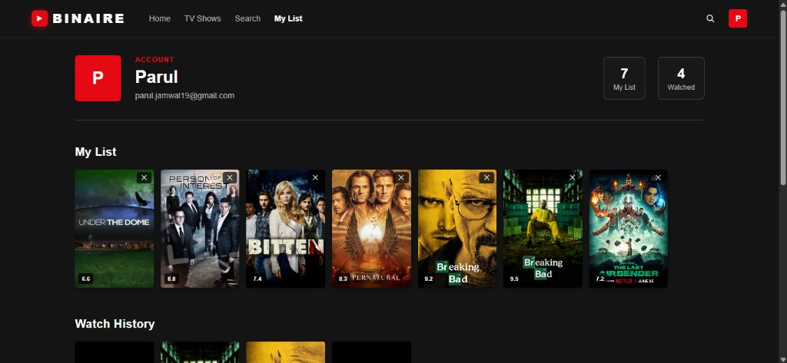
  <br /><sub>My List</sub>
</p>

<p align="center">
  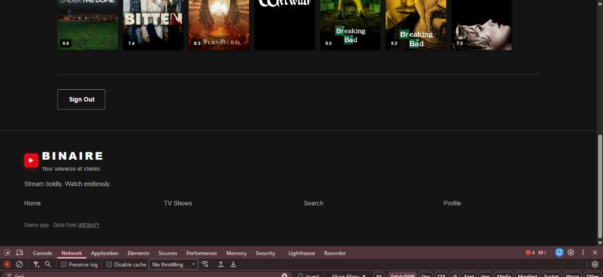
  <br /><sub>Sign out</sub>
</p>

<p align="center">
  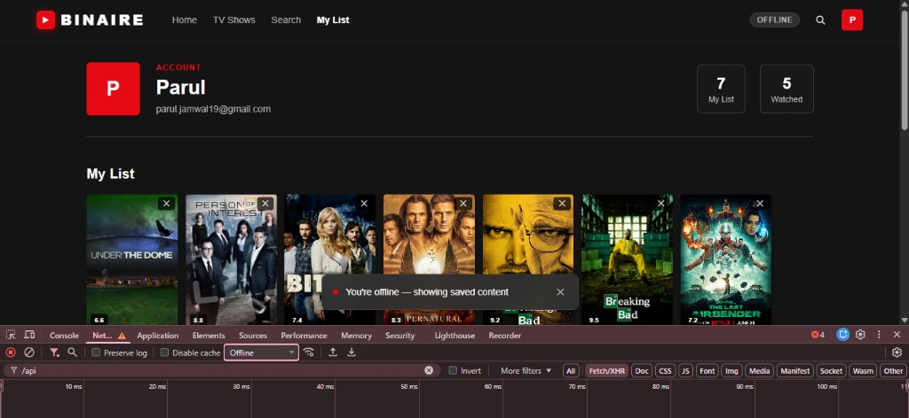
  <br /><sub>Offline</sub>
</p>

<p align="center">
  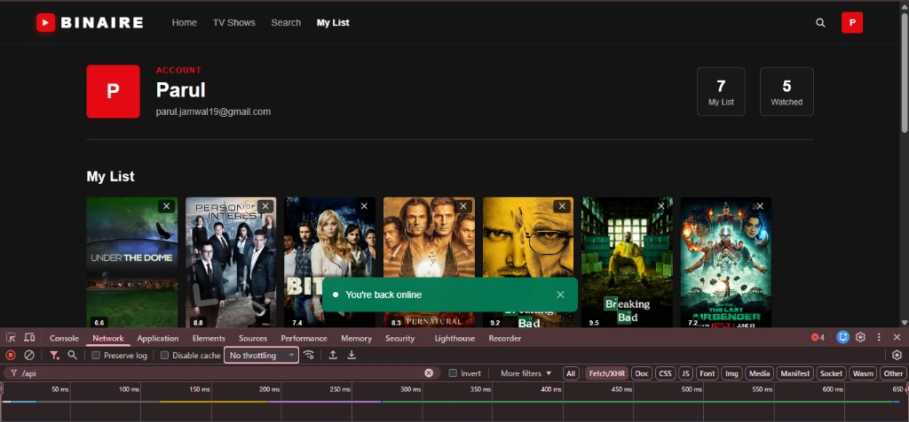
  <br /><sub>Back online</sub>
</p>

### Footer

<p align="center">
  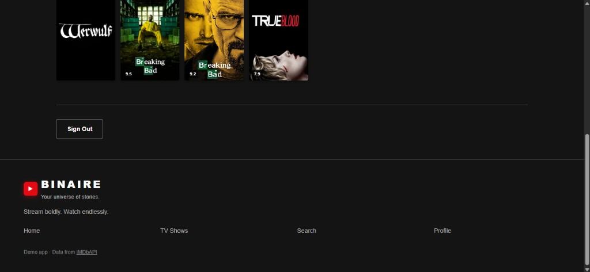
</p>

---

## What it does

- Hero banner + horizontal content rows (trending, popular, classics)
- Full browse grid with infinite scroll
- Search by **title**, **IMDb ID** (`tt0903747`), or **year**
- Firebase email/password auth — login, signup, protected profile
- Watchlist & watch history (local storage)
- Offline-friendly caching when the network drops

---

## Stack

React 19 · TypeScript · Vite · Tailwind CSS v4 · React Router · Firebase Auth · [IMDbAPI](https://imdbapi.dev/)

---

## Run locally

```bash
npm install
cp .env.example .env   # add Firebase keys + API URL
npm run dev
```

`.env` needs:

```env
VITE_API_BASE_URL=https://api.imdbapi.dev
VITE_FIREBASE_API_KEY=...
VITE_FIREBASE_AUTH_DOMAIN=...
VITE_FIREBASE_PROJECT_ID=...
VITE_FIREBASE_STORAGE_BUCKET=...
VITE_FIREBASE_MESSAGING_SENDER_ID=...
VITE_FIREBASE_APP_ID=...
```

Build: `npm run build`

---

## Deploy

Hosted on **Netlify** with env vars matching `.env.example`. SPA redirects are in `public/_redirects` and `netlify.toml`.

---

## Data

Title metadata comes from [IMDbAPI](https://imdbapi.dev/) (`/titles`, `/search/titles`, `/titles/{id}`).
